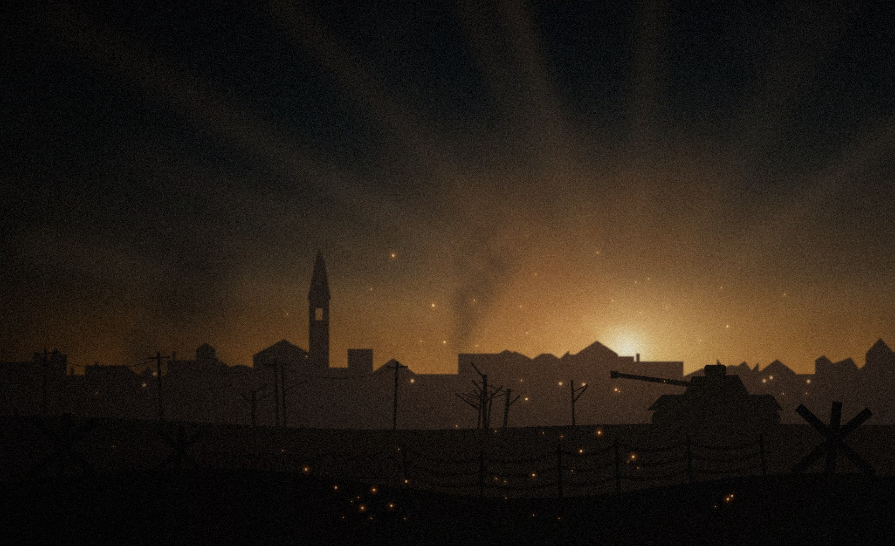
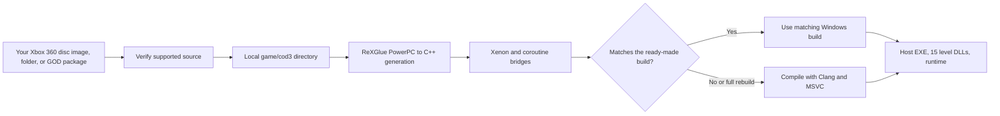

# Project 1944

**An unofficial native Windows PC port of Call of Duty 3 (Xbox 360).**

English · [Русский](README.ru.md) · [Українська](README.uk.md) · [Community](https://discord.gg/7sGEwV3sB) · [Releases](https://github.com/zenit2893-cmyk/project-1944/releases)

> **Source repository.** There is no downloadable Project 1944 release here yet. The build in the development workspace is not a public release. Do not download a similarly named archive from an unverified source.

Project 1944 statically recompiles the supported Xbox 360 game's PowerPC code to C++ using [ReXGlue](https://github.com/rexglue/rexglue-sdk), then builds a Windows x64 host and 15 campaign level DLLs. The runtime uses Xenia-derived kernel and graphics layers. This is a native PC build rather than an emulator frontend.

**Unofficial fan project. Not affiliated with or endorsed by Activision, Treyarch, or Microsoft. No game files are included in this repository. You need your own legally obtained copy of Call of Duty 3 for Xbox 360.**

## Current scope

- Windows 10/11 x64 campaign build with Direct3D 12 output.
- Keyboard and mouse, including raw mouse look, menu mouse input, on-screen PC button prompts, and mouse controls for the supported quick-time events. XInput pads are supported; PlayStation and Switch Pro controllers use SDL/HIDAPI.
- Windowed and full-screen output at 720p, 1080p, or 1440p; render-scale settings from ×1 to ×3; 60 Hz and 120 Hz modes.
- A PowerShell/WPF launcher with installation, graphics and controls settings, six interface languages, resumable installation, and a bug-report button. It accepts an ISO, an extracted `default.xex` folder, or a supported Games on Demand container.
- Level transitions stay within the host process, and loaded cutscenes can be skipped.

The development build was exercised on the first Saint-Lô mission, including gameplay, checkpoint save/load, and a 120 Hz timing trace on one PC. **The whole campaign and performance on other PCs have not been verified.** See the dated [engineering log](docs/devlog.md) and [tester guide](docs/testers.md) for test scope.

## What you need

| Requirement | Detail |
| --- | --- |
| OS | Windows 10 or 11, x64 |
| GPU | Direct3D 12 capable |
| Game | Your own Call of Duty 3 (USA, Europe) Xbox 360 copy; Title ID `415607E1`, Media ID `2E07093A` |
| Space | About 7 GB for installation; about 12 GB when doing a full compile |
| Internet | Needed only to obtain MSVC and Windows SDK for a full compile if Visual Studio C++ is unavailable |

The supported `default.xex` SHA-256 is `2944EEC7D1231AD6798B5F9F8ADF8855F5E489296B22EAB45B27A577CEE23692`. The launcher verifies the game source before installation. It does not fetch the game from the internet.

## Quick start when a release is available

1. Download `cod3-pc-full.zip` from this repository's [Releases](https://github.com/zenit2893-cmyk/project-1944/releases) page and unpack it on a drive with enough free space.
2. Run `Project1944.exe`. If the executable is blocked, `launcher\PLAY-COD3.cmd` opens the same launcher.
3. Select your own ISO, extracted `default.xex`, or supported `415607E1\00007000` Games on Demand folder. Drag and drop is also supported.
4. Choose **Install and play**. The launcher verifies the source, copies it into `game\cod3` locally, and performs its recompilation check.

The launcher has a switch to skip the local recompilation check and a separate **Rebuild the game** action for a full compile. The exact instructions and limitations are in [docs/testers.md](docs/testers.md). No game, compiler, or generated game C++ belongs in Git.

## How it works

The package compares the locally generated code with hashes of the code used for its ready-made build. If they match byte for byte, recompilation does not need another full compile. A different revision or a requested rebuild takes longer and needs the compiler. The reference hashes are produced during packaging; the game-derived C++ is generated on the player's machine.

## Controls

| Action | Default |
| --- | --- |
| Move / sprint / jump | WASD / Shift / Space |
| Crouch / prone | C / Ctrl or Z |
| Fire / aim | Left / right mouse button |
| Reload / use | R / F or E |
| Grenades / melee | G or 4 / V |
| Objectives / pause | Tab / Esc |
| Turn a QTE control / row | Mouse circles, wheel, or WASD / mouse strokes |

See [docs/controls.md](docs/controls.md) for the complete mapping and gamepad behavior.

## Known issues and reports

- Grass may render as stretched strips. The default workaround hides grass blades; the root cause is still being investigated.
- Not every campaign level has been played through. Please identify the mission and checkpoint in reports.
- Older DirectInput-only gamepads are not detected by default.
- Windows Smart App Control or antivirus heuristics may block an unsigned local build; see [docs/antivirus.md](docs/antivirus.md) before changing any Windows setting.

Use the launcher's **Bug report** button and attach its diagnostic ZIP to an issue or share it in [Discord](https://discord.gg/7sGEwV3sB). **Do not upload game files, disc images, generated game code, or private data.**

## Build and repository layout

The [build guide](docs/build-from-source.md) explains the SDK, toolchain, verified source revision, `scripts/build-cod3.ps1`, launcher build, and release packaging. This source tree intentionally excludes the game, generated game code, prebuilt binaries, toolchains, and local caches.

| Path | Purpose |
| --- | --- |
| `cod3-pc/` | Windows host, configuration, and build definitions |
| `integration/` | Controls, timing, runtime patches, graphics work, bridges, and packaging |
| `launcher/` | PowerShell/WPF launcher and original project artwork |
| `scripts/` | Installation, recompilation, packaging, and repository checks |
| `analysis/` | Source revision hashes and safe code-generation metadata |
| `tests/` | Source-only tests and probes |
| `tools/` | Tool provisioning scripts and pinned upstream submodules |
| `docs/` | Player guides, legal notes, and engineering history |

Before contributing, run `pwsh -NoProfile -File scripts/repo/Test-RepoContent.ps1 -StrictPersonalPaths`. See [CONTRIBUTING.md](CONTRIBUTING.md) for the publication and translation rules.

## Acknowledgements and related PC ports

**Thank you to [GenryTheFox](https://github.com/GenryTheFox0), who helped me with the Call of Duty 3 PC port and tested it.** His separate projects are [Project 2099, a Spider-Man: Edge of Time PC port](https://github.com/GenryTheFox0/Project-2099), and [Project Iron 6, a Tekken 6 PC port](https://github.com/GenryTheFox0/Project-Iron-6).

The recompilation and runtime work builds on [ReXGlue](https://github.com/rexglue/rexglue-sdk), [Xenia](https://github.com/xenia-project/xenia), [Xenia Canary](https://github.com/xenia-canary/xenia-canary), [XenonRecomp](https://github.com/hedge-dev/XenonRecomp), and [XenosRecomp](https://github.com/hedge-dev/XenosRecomp). Additional tooling includes [xdvdfs](https://github.com/antangelo/xdvdfs), [PortableMSVC](https://github.com/tgbender/portablemsvc), LLVM/Clang, CMake, Ninja, SDL, FFmpeg, libmspack, PowerShell, and GNU binutils. Individual terms and notices are in [THIRD-PARTY-NOTICES.md](integration/release-packaging/THIRD-PARTY-NOTICES.md) and [docs/legal.md](docs/legal.md).

## License and community

Project-authored source code is offered under [BSD-3-Clause](LICENSE). Xenia's original notice is kept in [licenses/xenia/LICENSE](licenses/xenia/LICENSE); upstream and bundled components have their own licenses. The game and its assets remain the property of their respective owners.

Join the [Project 1944 Discord](https://discord.gg/7sGEwV3sB) for support. [Optional donations](https://donatepay.ru/don/1456210) support development time; the project is free and does not sell game content.
