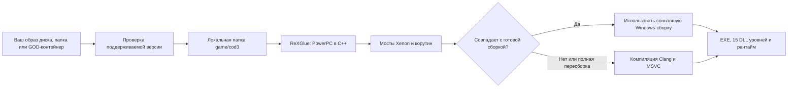

# Project 1944

**Неофициальный нативный PC-порт Call of Duty 3 с Xbox 360 для Windows.**

[English](README.md) · Русский · [Українська](README.uk.md) · [Сообщество](https://discord.gg/7sGEwV3sB) · [Релизы](https://github.com/zenit2893-cmyk/project-1944/releases)

> **Репозиторий исходников.** Публичного релиза Project 1944 здесь пока нет. Сборка в рабочей папке разработчика не является публичным выпуском. Не скачивайте архивы с похожим названием из непроверенных источников.

Project 1944 статически переводит PowerPC-код поддерживаемой Xbox 360-версии игры в C++ с помощью [ReXGlue](https://github.com/rexglue/rexglue-sdk), затем собирает Windows x64-приложение и 15 DLL уровней кампании. Рантайм использует слои ядра и графики, производные от Xenia. Это нативная сборка для ПК, а не оболочка эмулятора.

**Неофициальный фанатский проект, не связанный с Activision, Treyarch и Microsoft и не одобренный ими. Игровых файлов в репозитории нет. Нужна собственная легально приобретённая копия Call of Duty 3 для Xbox 360.**

## Что уже есть

- Сборка кампании для Windows 10/11 x64 с выводом через Direct3D 12.
- Клавиатура и мышь: прямое управление обзором, мышь в меню, подсказки клавиш на экране и управление поддерживаемыми QTE. Поддерживаются геймпады XInput; контроллеры PlayStation и Switch Pro работают через SDL/HIDAPI.
- Оконный и полноэкранный режимы с выводом 720p, 1080p или 1440p; масштаб рендера ×1–×3; режимы 60 и 120 Гц.
- Лаунчер на PowerShell/WPF: установка, настройки графики и управления, шесть языков интерфейса, продолжение прерванной установки и сбор отчёта об ошибке. Он принимает ISO, распакованную папку с `default.xex` или поддерживаемый Games on Demand-контейнер.
- Переходы между уровнями без выхода на рабочий стол и возможность пропускать уже загруженные ролики.

На рабочей сборке проверялись первая миссия Saint-Lô, игровой процесс, сохранение и загрузка чекпоинта, а также трасса режима 120 Гц на одном ПК. **Прохождение всей кампании и производительность на других компьютерах не проверены.** Границы тестов описаны в датированном [журнале разработки](docs/devlog.md) и [инструкции для тестеров](docs/testers.md).

## Что потребуется

| Требование | Подробности |
| --- | --- |
| ОС | Windows 10 или 11, x64 |
| Видеокарта | Поддержка Direct3D 12 |
| Игра | Собственная копия Call of Duty 3 (USA, Europe) для Xbox 360; Title ID `415607E1`, Media ID `2E07093A` |
| Место | Около 7 ГБ для установки; около 12 ГБ при полной компиляции |
| Интернет | Только для получения MSVC и Windows SDK при полной компиляции, если Visual Studio C++ не установлен |

SHA-256 поддерживаемого `default.xex`: `2944EEC7D1231AD6798B5F9F8ADF8855F5E489296B22EAB45B27A577CEE23692`. Лаунчер проверяет источник до установки. Игру из интернета он не скачивает.

## Быстрый старт после появления релиза

1. Скачайте `cod3-pc-full.zip` на странице [Releases](https://github.com/zenit2893-cmyk/project-1944/releases) этого репозитория и распакуйте его на диск с достаточным свободным местом.
2. Запустите `Project1944.exe`. Если Windows заблокирует исполняемый файл, `launcher\PLAY-COD3.cmd` откроет тот же лаунчер.
3. Выберите собственный ISO, распакованный `default.xex` или поддерживаемую папку Games on Demand `415607E1\00007000`. Можно также перетащить источник в окно.
4. Нажмите **«Установить и играть»**. Лаунчер проверит источник, скопирует его локально в `game\cod3` и выполнит проверку рекомпиляции.

В лаунчере можно отключить локальную проверку рекомпиляции; отдельная кнопка **«Пересобрать игру»** запускает полную компиляцию. Точные шаги и ограничения приведены в [docs/testers.md](docs/testers.md). Игре, компилятору и сгенерированному игровому C++ нет места в Git.

## Как это работает

Пакет сравнивает локально сгенерированный код с хешами кода, из которого создана готовая сборка. При побайтовом совпадении повторная полная компиляция не нужна. Для другой ревизии или по команде пользователя сборка займёт больше времени и потребует компилятор. Эталонные хеши создаются при упаковке; производный от игры C++ появляется на компьютере пользователя.

## Управление

| Действие | По умолчанию |
| --- | --- |
| Движение / бег / прыжок | WASD / Shift / Space |
| Присесть / лечь | C / Ctrl или Z |
| Огонь / прицеливание | Левая / правая кнопка мыши |
| Перезарядка / действие | R / F или E |
| Гранаты / ближний бой | G или 4 / V |
| Задачи / пауза | Tab / Esc |
| Повернуть механизм QTE / грести | Круги мышью, колесо или WASD / движения мышью |

Полная таблица и особенности геймпадов — в [docs/controls.md](docs/controls.md).

## Известные проблемы и отчёты

- Трава иногда отображается вытянутыми полосами. Обходной режим скрывает стебли; первопричина ещё не найдена.
- Не все уровни кампании пройдены вживую. В отчёте указывайте миссию и чекпоинт.
- Старые геймпады только с DirectInput по умолчанию не обнаруживаются.
- Smart App Control и антивирус могут блокировать неподписанную локальную сборку; перед изменением настроек Windows прочитайте [docs/antivirus.md](docs/antivirus.md).

Нажмите **«Отчёт об ошибке»** в лаунчере и приложите полученный ZIP к issue либо отправьте его в [Discord](https://discord.gg/7sGEwV3sB). **Не загружайте игровые файлы, образы диска, сгенерированный игровой код или личные данные.**

## Сборка и устройство репозитория

В [инструкции по сборке](docs/build-from-source.md) описаны SDK, инструменты, проверенная ревизия игры, `scripts/build-cod3.ps1`, сборка лаунчера и упаковка релиза. Здесь намеренно отсутствуют игра, сгенерированный игровой код, готовые бинарники, компиляторы и локальный кэш.

| Путь | Назначение |
| --- | --- |
| `cod3-pc/` | Windows-приложение, настройки и файлы сборки |
| `integration/` | Управление, тайминг, патчи рантайма, графика, мосты и упаковка |
| `launcher/` | Лаунчер PowerShell/WPF и авторская графика |
| `scripts/` | Установка, рекомпиляция, упаковка и проверка репозитория |
| `analysis/` | Хеши поддерживаемой версии и безопасные метаданные кодогенерации |
| `tests/` | Исходники тестов и проверок |
| `tools/` | Скрипты получения инструментов и закреплённые upstream-подмодули |
| `docs/` | Инструкции, правовые заметки и история разработки |

Перед отправкой изменений запустите `pwsh -NoProfile -File scripts/repo/Test-RepoContent.ps1 -StrictPersonalPaths`. Правила публикации и переводов — в [CONTRIBUTING.md](CONTRIBUTING.md).

## Благодарность и другие PC-порты

**Спасибо [GenryTheFox](https://github.com/GenryTheFox0): он помогал мне с PC-портом Call of Duty 3 и тестировал его.** Его отдельные проекты — [Project 2099, PC-порт Spider-Man: Edge of Time](https://github.com/GenryTheFox0/Project-2099), и [Project Iron 6, PC-порт Tekken 6](https://github.com/GenryTheFox0/Project-Iron-6).

Основа рекомпиляции и рантайма — [ReXGlue](https://github.com/rexglue/rexglue-sdk), [Xenia](https://github.com/xenia-project/xenia), [Xenia Canary](https://github.com/xenia-canary/xenia-canary), [XenonRecomp](https://github.com/hedge-dev/XenonRecomp) и [XenosRecomp](https://github.com/hedge-dev/XenosRecomp). Также используются [xdvdfs](https://github.com/antangelo/xdvdfs), [PortableMSVC](https://github.com/tgbender/portablemsvc), LLVM/Clang, CMake, Ninja, SDL, FFmpeg, libmspack, PowerShell и GNU binutils. Условия и уведомления перечислены в [THIRD-PARTY-NOTICES.md](integration/release-packaging/THIRD-PARTY-NOTICES.md) и [docs/legal.md](docs/legal.md).

## Лицензия и сообщество

Исходники, созданные участниками проекта, предлагаются по [BSD-3-Clause](LICENSE). Исходное уведомление Xenia сохранено в [licenses/xenia/LICENSE](licenses/xenia/LICENSE); у внешних компонентов собственные лицензии. Игра и её ресурсы принадлежат правообладателям.

Поддержка — в [Discord Project 1944](https://discord.gg/7sGEwV3sB). [Добровольные пожертвования](https://donatepay.ru/don/1456210) помогают оплачивать время разработки; проект бесплатен и не продаёт игровые материалы.
