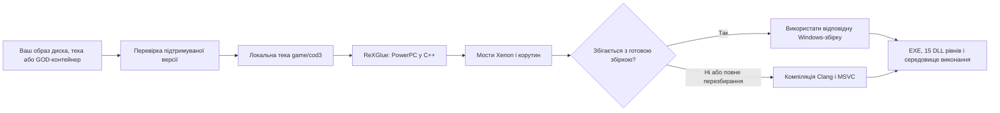

# Project 1944

**Неофіційний нативний ПК-порт Call of Duty 3 з Xbox 360 для Windows.**

[English](README.md) · [Русский](README.ru.md) · Українська · [Спільнота](https://discord.gg/7sGEwV3sB) · [Релізи](https://github.com/zenit2893-cmyk/project-1944/releases)

> **Репозиторій вихідного коду.** Публічного релізу Project 1944 тут поки немає. Збірка в робочій теці розробника не є публічним випуском. Не завантажуйте архіви зі схожою назвою з неперевірених джерел.

Project 1944 статично перекомпілює PowerPC-код підтримуваної версії гри для Xbox 360 у C++ за допомогою [ReXGlue](https://github.com/rexglue/rexglue-sdk), а потім збирає Windows x64-застосунок і 15 DLL рівнів кампанії. Середовище виконання використовує шари ядра та графіки, похідні від Xenia. Це нативна збірка для ПК, а не оболонка емулятора.

**Неофіційний фанатський проєкт, не пов'язаний з Activision, Treyarch і Microsoft та не схвалений ними. Репозиторій не містить файлів гри. Вам потрібна власна законно придбана копія Call of Duty 3 для Xbox 360.**

## Поточні можливості

- Збірка кампанії для Windows 10/11 x64 із виведенням через Direct3D 12.
- Клавіатура й миша: безпосереднє керування оглядом, миша в меню, підказки клавіш на екрані та керування підтримуваними QTE. Підтримуються геймпади XInput; контролери PlayStation і Switch Pro працюють через SDL/HIDAPI.
- Віконний і повноекранний режими з виведенням 720p, 1080p або 1440p; масштаб рендерингу ×1–×3; режими 60 і 120 Гц.
- Лаунчер на PowerShell/WPF: установлення, налаштування графіки й керування, шість мов інтерфейсу, продовження перерваного встановлення та створення звіту про помилку. Він приймає ISO, розпаковану теку з `default.xex` або підтримуваний контейнер Games on Demand.
- Переходи між рівнями без виходу на робочий стіл і можливість пропускати вже завантажені ролики.

На робочій збірці перевірялися перша місія Saint-Lô, ігровий процес, збереження й завантаження контрольної точки, а також трасування режиму 120 Гц на одному ПК. **Проходження всієї кампанії та швидкодію на інших комп'ютерах не перевірено.** Межі тестів описані в датованому [журналі розробки](docs/devlog.md) та [інструкції для тестувальників](docs/testers.md).

## Що потрібно

| Вимога | Подробиці |
| --- | --- |
| ОС | Windows 10 або 11, x64 |
| Відеокарта | Підтримка Direct3D 12 |
| Гра | Власна копія Call of Duty 3 (USA, Europe) для Xbox 360; Title ID `415607E1`, Media ID `2E07093A` |
| Місце | Близько 7 ГБ для встановлення; близько 12 ГБ за повної компіляції |
| Інтернет | Потрібен лише для отримання MSVC і Windows SDK під час повної компіляції, якщо Visual Studio C++ не встановлено |

SHA-256 підтримуваного `default.xex`: `2944EEC7D1231AD6798B5F9F8ADF8855F5E489296B22EAB45B27A577CEE23692`. Лаунчер перевіряє джерело до встановлення. Він не завантажує гру з інтернету.

## Швидкий початок після появи релізу

1. Завантажте `cod3-pc-full.zip` зі сторінки [Releases](https://github.com/zenit2893-cmyk/project-1944/releases) цього репозиторію та розпакуйте його на диск із достатнім вільним місцем.
2. Запустіть `Project1944.exe`. Якщо Windows заблокує виконуваний файл, `launcher\PLAY-COD3.cmd` відкриє той самий лаунчер.
3. Виберіть власний ISO, розпакований `default.xex` або підтримувану теку Games on Demand `415607E1\00007000`. Джерело також можна перетягнути у вікно.
4. Натисніть **«Установити та грати»**. Лаунчер перевірить джерело, скопіює його локально до `game\cod3` і виконає перевірку перекомпіляції.

У лаунчері можна вимкнути локальну перевірку перекомпіляції; окрема дія **«Перезібрати гру»** запускає повну компіляцію. Точні кроки й обмеження наведено в [docs/testers.md](docs/testers.md). Файли гри, компілятор і згенерований ігровий C++ не повинні потрапляти до Git.

## Як це працює

Пакет порівнює локально згенерований код із хешами коду, з якого створено готову збірку. За побайтового збігу повторна повна компіляція не потрібна. Для іншої ревізії або на вимогу користувача збірка триватиме довше й потребуватиме компілятора. Еталонні хеші створюються під час пакування; C++, похідний від гри, з'являється на комп'ютері користувача.

## Керування

| Дія | Типово |
| --- | --- |
| Рух / біг / стрибок | WASD / Shift / Space |
| Присісти / лягти | C / Ctrl або Z |
| Вогонь / прицілювання | Ліва / права кнопка миші |
| Перезарядити / взаємодія | R / F або E |
| Гранати / ближній бій | G або 4 / V |
| Завдання / пауза | Tab / Esc |
| Повернути механізм QTE / гребти | Рухи мишею по колу, коліщатко або WASD / рухи мишею |

Повна таблиця та особливості геймпадів — у [docs/controls.md](docs/controls.md).

## Відомі проблеми та звіти

- Трава іноді відображається витягнутими смугами. Тимчасовий режим приховує стебла; першопричину ще не знайдено.
- Не всі рівні кампанії пройдено під час тестів. У звіті вказуйте місію та контрольну точку.
- Старі геймпади, що підтримують лише DirectInput, типово не виявляються.
- Smart App Control або антивірус можуть блокувати непідписану локальну збірку; перш ніж змінювати налаштування Windows, прочитайте [docs/antivirus.md](docs/antivirus.md).

Натисніть **«Звіт про помилку»** в лаунчері та додайте отриманий ZIP до issue або надішліть його в [Discord](https://discord.gg/7sGEwV3sB). **Не завантажуйте файли гри, образи диска, згенерований ігровий код або особисті дані.**

## Збірка та структура репозиторію

В [інструкції зі збірки](docs/build-from-source.md) описано SDK, інструменти, перевірену ревізію гри, `scripts/build-cod3.ps1`, збірку лаунчера й пакування релізу. Тут навмисно немає гри, згенерованого ігрового коду, готових бінарних файлів, компіляторів і локального кешу.

| Шлях | Призначення |
| --- | --- |
| `cod3-pc/` | Windows-застосунок, налаштування та файли збірки |
| `integration/` | Керування, таймінг, патчі середовища виконання, графіка, мости й пакування |
| `launcher/` | Лаунчер PowerShell/WPF та авторська графіка |
| `scripts/` | Установлення, перекомпіляція, пакування й перевірка репозиторію |
| `analysis/` | Хеші підтримуваної версії та безпечні метадані генерації коду |
| `tests/` | Вихідний код тестів і перевірок |
| `tools/` | Скрипти отримання інструментів і закріплені upstream-підмодулі |
| `docs/` | Інструкції, правові примітки та історія розробки |

Перед надсиланням змін запустіть `pwsh -NoProfile -File scripts/repo/Test-RepoContent.ps1 -StrictPersonalPaths`. Правила публікації та перекладів — у [CONTRIBUTING.md](CONTRIBUTING.md).

## Подяка та інші ПК-порти

**Дякую [GenryTheFox](https://github.com/GenryTheFox0): він допомагав мені з ПК-портом Call of Duty 3 і тестував його.** Його окремі проєкти — [Project 2099, ПК-порт Spider-Man: Edge of Time](https://github.com/GenryTheFox0/Project-2099), та [Project Iron 6, ПК-порт Tekken 6](https://github.com/GenryTheFox0/Project-Iron-6).

Основа перекомпіляції та середовища виконання — [ReXGlue](https://github.com/rexglue/rexglue-sdk), [Xenia](https://github.com/xenia-project/xenia), [Xenia Canary](https://github.com/xenia-canary/xenia-canary), [XenonRecomp](https://github.com/hedge-dev/XenonRecomp) і [XenosRecomp](https://github.com/hedge-dev/XenosRecomp). Також використовуються [xdvdfs](https://github.com/antangelo/xdvdfs), [PortableMSVC](https://github.com/tgbender/portablemsvc), LLVM/Clang, CMake, Ninja, SDL, FFmpeg, libmspack, PowerShell і GNU binutils. Умови та повідомлення наведено в [THIRD-PARTY-NOTICES.md](integration/release-packaging/THIRD-PARTY-NOTICES.md) і [docs/legal.md](docs/legal.md).

## Ліцензія та спільнота

Вихідний код, створений учасниками проєкту, пропонується за [BSD-3-Clause](LICENSE). Початкове повідомлення Xenia збережено в [licenses/xenia/LICENSE](licenses/xenia/LICENSE); сторонні компоненти мають власні ліцензії. Гра та її ресурси належать відповідним правовласникам.

Підтримка — у [Discord Project 1944](https://discord.gg/7sGEwV3sB). [Добровільні пожертви](https://donatepay.ru/don/1456210) допомагають оплачувати час розробки; проєкт безкоштовний і не продає ігрові матеріали.
